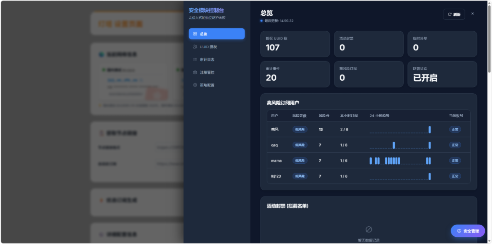
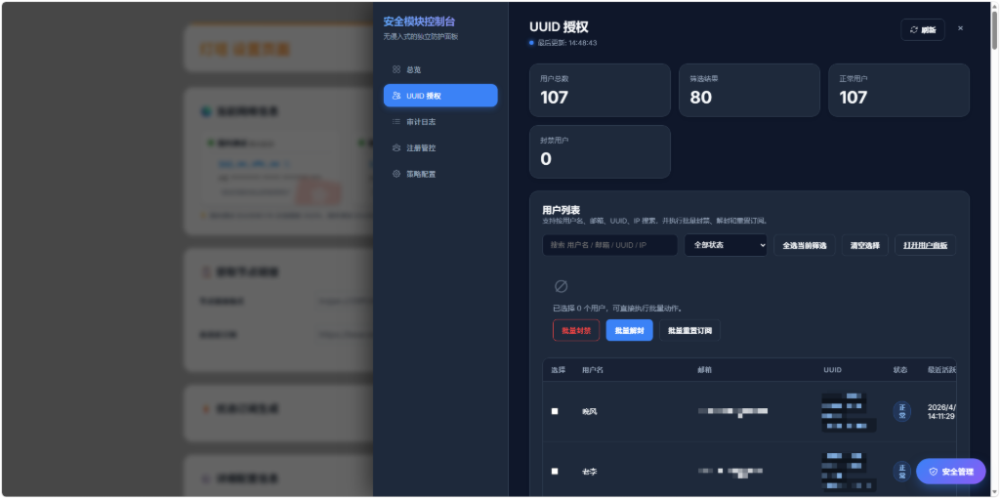
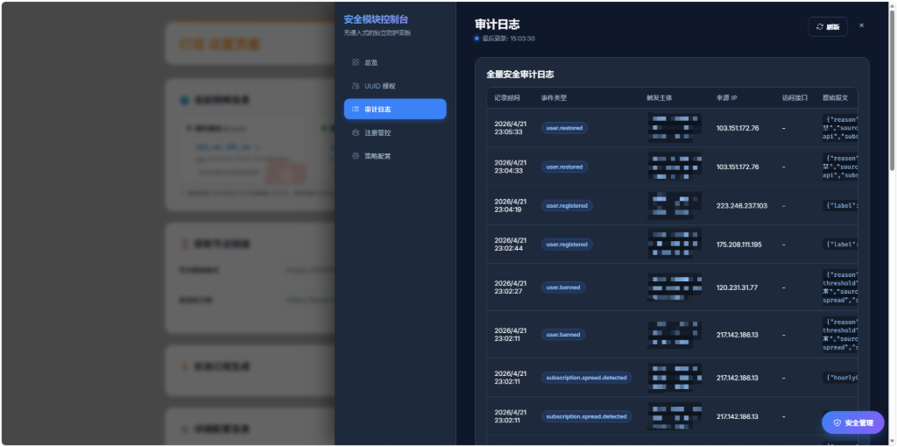
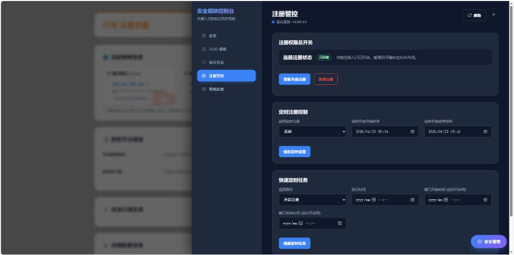
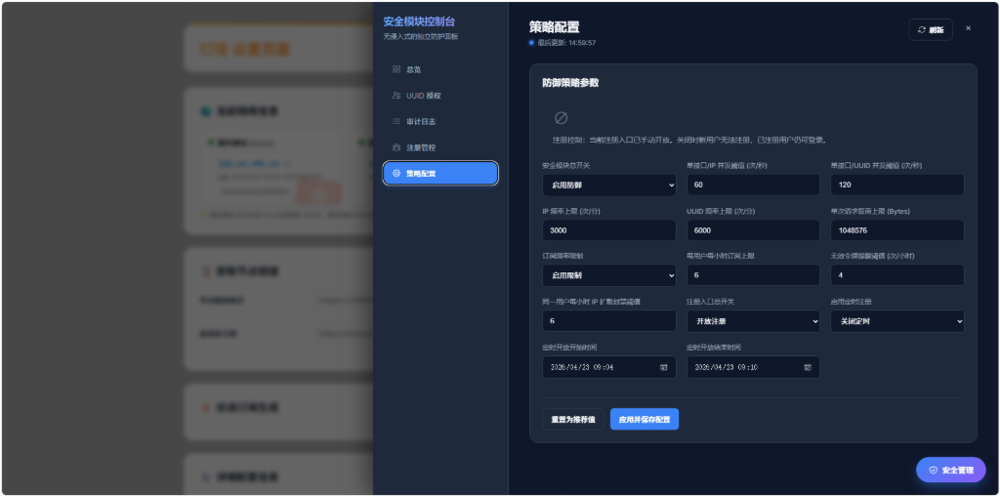

# 🚀 beacon-cm — Cloudflare Workers 边缘隧道 + 安全管控平台

[](https://github.com/cmliu/edgetunnel/stargazers)
[](https://github.com/cmliu/edgetunnel/network/members)
[](https://github.com/cmliu/edgetunnel/blob/main/LICENSE)
[](#本地验证)

---

## 📖 项目简介

**beacon-cm** 是基于 edgetunnel 2.1 VLESS/Trojan 多功能面板[cmliu/edgetunnel](https://github.com/cmliu/edgetunnel)二开，内置完整的安全防护与用户管理体系。在保留原版 edgetunnel 全部核心能力的基础上，新增了：

- 🔐 **统一认证面板**：注册、登录、会话管理一站式解决
- 🛡️ **订阅风控引擎**：频率限制、IP 扩散检测、无效令牌监控，自动封禁异常账号
- 📊 **可视化安全后台**：总览仪表盘、用户管理、审计日志、注册管控、策略配置五大模块
- ⏰ **定时注册控制**：支持按时间段自动开启/关闭注册入口，支持快速创建定时任务
- 🚀 **多级缓存加速**：内存缓存 → Durable Objects → KV 三级缓存，200+ 用户场景响应提升 **10~100 倍**

### ✨ 核心特性

| 模块 | 能力 |
|------|------|
| 🛡️ **协议支持** | VLESS、Trojan、Shadowsocks 等主流协议，深度集成加密传输 |
| 👥 **用户系统** | 注册/登录/UUID 授权，密码哈希存储，会话 Token 管理 |
| 📊 **管理面板** | 五大功能模块（总览、用户、审计、注册、配置），深色主题 |
| 🔄 **订阅系统** | 自动生成订阅地址，适配 Clash/Sing-box/Surge 等主流客户端 |
| 🎯 **风控防护** | 频率限制（6次/小时）、IP 扩散检测（6个/小时）、无效令牌封禁 |
| ⏰ **定时任务** | 注册窗口定时开关、一键创建开启/关闭定时任务 |
| ⚡ **性能优化** | 三级缓存架构 + DO 批量读取 + 列表聚合缓存 |
| 🌐 **多端适配** | Windows、Android、iOS、macOS 及各种软路由固件 |

---

## 💡 后台预览

     

## 💡 快速部署
>[!TIP]
> 📖 **详尽图文教程**：[edgetunnel 部署指南](https://cmliussss.com/p/edt2/)

>[!WARNING]
> ⚠️ **Error 1101 问题**：[视频解析](https://www.youtube.com/watch?v=r4uVTEJptdE)

### ⚙️ Workers 部署

<details>
<summary><code><strong>「 Workers 部署文字教程 」</strong></code></summary>

1. **部署 CF Worker**：
   - 在 CF Worker 控制台中创建一个新的 Worker。
   - 将 [`_worker.js`](_worker.js) 的内容粘贴到 Worker 编辑器中。
   - 在左侧 `设置` 选项卡中，选择 `变量` > `添加变量`。
     - 变量名称填写 **`ADMIN`**，值设为你的管理员密码，点击 `保存`。

2. **绑定 KV 命名空间**：
   - 在 `绑定` 选项卡中选择 `添加绑定 +` > `KV 命名空间` > `添加绑定`。
   - 选择已有命名空间或创建新的命名空间进行绑定。
   - `变量名称` 填写 **`KV`**，点击 `添加绑定`。

3. **（可选）绑定 Durable Objects**：
   - 在 `绑定` 选项卡中选择 `添加绑定 +` > `Durable Objects 命名空间`。
   - `变量名称` 填写 **`STATESTORE`**。
   - 可显著提升大规模用户场景下的数据读取性能。

4. **绑定自定义域**：
   - 在 Workers 控制台的 `触发器` 选项卡，点击 `添加自定义域`。
   - 填入已转入 CF 的次级域名，如 `vless.example.com`，等待证书生效。

5. **访问后台**：
   - 访问 `https://vless.example.com/admin` 输入管理员密码即可登录。

</details>

### 🛠 Pages 上传部署（**推荐**）

<details>
<summary><code><strong>「 Pages 上传文件部署文字教程 」</strong></code></summary>

1. **部署 CF Pages**：
   - 下载 [main.zip](https://github.com/cmliu/edgetunnel/archive/refs/heads/main.zip) 文件。
   - 在 CF Pages 控制台中选择 `上传资产`，为项目取名后点击 `创建项目`。
   - 上传下载好的 zip 文件后点击 `部署站点`。

2. **配置环境变量**：
   - 部署完成后点击 `继续处理站点` > `设置` > `环境变量`。
   - 制作为生产环境定义变量 > `添加变量`：
     - 变量名称 **`ADMIN`**，值为你的管理员密码。
   - 返回 `部署` 选项卡，右下角点击 `创建新部署`，重新上传 zip 文件并 `保存并部署`。

3. **绑定 KV 命名空间**：
   - 在 `设置` 选项卡中选择 `绑定` > `+ 添加` > `KV 命名空间`。
   - `变量名称` 填写 **`KV`**，保存后重试部署。

4. **（可选）绑定 Durable Objects**：
   - 同上，绑定名为 **`STATESTORE`** 的 Durable Objects 命名空间。

5. **绑定自定义域名**：
   - 在 Pages 控制台 `自定义域` 选项卡，点击 `设置自定义域`。
   - 填入次级域名（不要用根域名），按提示添加 CNAME 记录后激活。

6. **访问后台**：
   - 访问 `https://your-domain.example/admin` 输入管理员密码即可登录。

</details>

### 🛠 Pages + GitHub 自动部署

<details>
<summary><code><strong>「 Pages + GitHub 部署文字教程 」</strong></code></summary>

1. **Fork 项目** 并 Star ⭐
2. 在 CF Pages 控制台选择 `连接到 Git`，选中 Fork 后的项目，点击 `开始设置`。
3. 在 `构建和部署` 设置中，添加环境变量 **`ADMIN`**（管理员密码）。
4. 绑定 KV（变量名 **`KV`**）和可选的 Durable Objects（变量名 **`STATESTORE`**）。
5. 绑定自定义域名，访问 `https://your-domain.example/admin` 登录。

</details>

---

## 🔑 环境变量说明

### 必需变量

| 变量名 | 必填 | 示例 | 说明 |
|:---|:---:|:---|:---|
| **`ADMIN`** | ✅ | `123456` | 后台管理面板登录密码 |

### 可选变量

| 变量名 | 默认值 | 示例 | 说明 |
|:---|:---:|:---|:---|
| **`KEY`** | — | `CMLiussss` | 快速订阅路径密钥，访问 `/KEY` 即可获取节点 |
| **`UUID`** | — | `90cd4a77-...` | 强制固定 UUID（仅 UUIDv4 格式） |
| **`PROXYIP`** | — | `proxy.example.com:443` | 全局自定义反代 IP |
| **`URL`** | — | `https://example.com` | 默认主页伪装地址或 `1101` |
| **`GO2SOCKS5`** | — | `blog.com,*.ip111.cn` | 强制走 SOCKS5 的域名列表 |
| **`DEBUG`** | 关闭 | `true` | 开启调试日志（console.log） |
| **`OFF_LOG`** | 开启 | `true` | 关闭日志记录功能 |
| **`BEST_SUB`** | 关闭 | `true` | 开启优选订阅生成器 |

### 安全模块变量

| 变量名 | 默认值 | 说明 |
|:---|:---:|:---|
| **`SECURITY_ENABLED`** | `false` | 设为 `true` 启用安全模块（含认证+风控+后台） |
| **`SECURITY_REGISTER_ENABLED`** | `false` | 设为 `true` 开放用户自主注册 |
| **`SECURITY_CONFIG_JSON`** | — | JSON 格式一次性覆盖全部安全配置 |

#### 安全模块可覆盖参数

| 变量名 | 默认值 | 说明 |
|:---|:---:|:---|
| `SECURITY_ENDPOINT_SECOND_LIMIT` | `60` | 单接口每秒并发阈值 |
| `SECURITY_IP_MINUTE_LIMIT` | `3000` | 单 IP 每分钟请求上限 |
| `SECURITY_UUID_MINUTE_LIMIT` | `6000` | 单 UUID 每分钟请求上限 |
| `SECURITY_PAYLOAD_MAX_BYTES` | `1048576` | 单次请求载荷上限（字节） |
| `SECURITY_SUBSCRIPTION_HOURLY_LIMIT` | `6` | 每用户每小时订阅次数上限 |
| `SECURITY_SUBSCRIPTION_UNIQUE_IP_ALERT_LIMIT` | `6` | 同一用户每小时 IP 扩散封禁阈值 |
| `SECURITY_SUBSCRIPTION_INVALID_HOURLY_LIMIT` | `4` | 无效令牌触发告警次数 |

---

## 🛡️ 安全后台增强

本版本将完整的安全认证与风控体系内嵌至 `_worker.js`，无需拆分 Worker 即可获得企业级安全管理能力。

### 🏗️ 架构概览

```
┌─────────────────────────────────────────────┐
│              用户访问层                       │
│  /register        注册/登录页面               │
│  /sub             订阅接口（需认证）           │
│  /version         版本探活                    │
│  /admin           管理后台                    │
└──────────────────┬──────────────────────────┘
                   ▼
┌─────────────────────────────────────────────┐
│            L1 内存缓存 (Map)                  │
│  TTL: 5-30s | 用户列表聚合 10s              │
│  订阅状态 5s | 封禁状态 5s                   │
└──────────────────┬──────────────────────────┘
                   ▼ 未命中
┌─────────────────────────────────────────────┐
│      L2 Durable Objects (StateStore)         │
│  批量读取 | 低延迟 | 跨请求持久化             │
└──────────────────┬──────────────────────────┘
                   ▼ 未命中
┌─────────────────────────────────────────────┐
│           L3 Cloudflare KV                   │
│  持久存储 | 全球复制 | 最终一致性              │
└─────────────────────────────────────────────┘
```

### 🔐 统一认证面板

| 端点 | 方法 | 功能 |
|:---|:---:|:---|
| `/register` | GET | 注册/登录页面（含使用规则提示） |
| `/register/api` | POST | 用户注册（用户名 + 邮箱 + 密码） |
| `/register/login` | POST | 用户登录（返回 UUID + 订阅地址） |
| `/register/session` | GET | 当前会话状态 |
| `/register/logout` | POST | 退出登录 |

- 密码要求：至少 8 位，包含大小写字母、数字和特殊字符
- 登录连续失败 **5 次** 后锁定 **15 分钟**
- 支持"记住我"持久会话
- 登录成功后返回专属 UUID、版本探活地址与订阅地址

### 📊 安全后台五大模块

#### ① 总览（Overview）

- 实时统计卡片：活跃 UUID 数、当前封禁数、定时状态
- 高风险订阅用户排行（风险等级、风险分、本小时订阅、24h 趋势）
- 活跃封禁名单、冷却期名单、最近事件

#### ② UUID 授权（Users）

- 用户列表：搜索/筛选（全部/正常/被封禁）
- 批量操作：批量封禁/解禁
- 单用户详情：订阅状态、风险评分、24h 趋势图、最近 IP/UA、审计轨迹
- 快捷操作：封禁、解禁、重置订阅令牌

#### ③ 审计日志（Events）

- 全量安全事件记录（时间、类型、主体、来源 IP、原始报文）
- 支持按事件类型筛选

#### ④ 注册管控（Registration）

- 一键开放/关闭注册入口
- 定时注册控制：设置开始/结束时间，自动开关
- 快速定时任务：选择操作（开启/关闭/定时开/定时关），设置执行时间
- 待执行任务列表 + 历史任务记录
- 注册日志查看

#### ⑤ 策略配置（Config）

- 防御策略参数：并发阈值、频率上限、载荷限制
- 订阅频率限制：每小时上限、IP 扩散阈值、无效令牌阈值
- 注册控制：手动开关、定时开关（日历选择器）、定时时间
- 重置为推荐值 / 应用并保存配置

### 🎯 订阅风控规则

| 规则 | 阈值 | 重置周期 | 触发后果 |
|:---|:---:|:---|:---|
| 每小时订阅次数 | **6 次** | 每小时自动重置 | 超限后直接封禁 |
| IP 扩散检测 | **6 个不同 IP** | 每小时自动重置 | 超限后立即封禁 |
| 无效令牌检测 | **4 次** | 每小时 | 达到阈值后直接封禁 |

> 💡 **设计理念**：IP 扩散按小时重置而非按天重置，适应正常用户移动网络/WiFi 切换场景。同一 IP 重复出现不重复计数。

### 🚀 性能优化亮点

| 优化项 | 效果 |
|:---|:---|
| **列表聚合缓存** | 用户列表/封禁列表首次加载后 10s 内直接返回 |
| **DO 批量读取** | 一次网络往返批量获取多条数据，替代逐条串行读取 |
| **订阅状态缓存** | 每用户订阅状态 5s 内免 KV 读取 |
| **封禁状态缓存** | 未过期封禁记录 5s 内命中即返回 |
| **写入智能失效** | 用户数据变更时自动清除相关列表缓存 |
| **实际效果** | 200 用户规模下，后台加载从 **3-8s 降至 0.3-1s** |

### 📡 客户端身份传递

已注册客户端可通过以下任一方式传递唯一身份：

- 请求头：`X-Client-UUID`
- 查询参数：`client_uuid`
- Cookie：`client_uuid`

---

## 🔧 高级实用技巧

### 修改订阅 TOKEN 和验证 UUID

修改 `ADMIN` 或 `KEY` 变量的值，即可随机更换订阅 TOKEN 和节点验证 UUID。设置 `UUID` 变量可强制固定（仅 UUIDv4 格式）。

### 动态切换代理方案

通过 URL PATH 参数动态指定底层代理：

```bash
# 自定义反代 IP
/?proxyip=proxyip.example.com

# SOCKS5 代理
/socks5=user:password@127.0.0.1:1080
/socks5://dXNlcjpwYXNzd29yZA==@127.0.0.1:1080  # Base64 编码（全局激活）

# HTTP 代理
/http=user:password@127.0.0.1:8080
```

---

## 💻 客户端适配情况

| 平台 | 推荐客户端 | 备注 |
|:---|:---|:---|
| **Windows** | v2rayN, FlClash, mihomo-party, Clash Verge Rev | 全面支持 |
| **Android** | ClashMetaForAndroid, FlClash, v2rayNG | 建议 Meta 核心 |
| **iOS** | Surge, Shadowrocket, Stash | 完美适配 |
| **macOS** | FlClash, mihomo-party, Clash Verge Rev, Surge | M1/M2 兼容 |

---

## 🧪 本地验证

```bash
# 运行安全模块测试套件（41 个测试用例）
node --test tests/security.test.mjs

# 运行集成冒烟测试
node scripts/security-smoke.mjs
```

### Docker 本地开发

```bash
docker compose up --build
```

启动 `wrangler dev` 并启用安全模块，可用于本地调试。

---

## ⭐ 项目热度

[](https://starchart.cc/cmliu/edgetunnel)

---

## 🙏 特别鸣谢

本项目基于 [cmliu/edgetunnel](https://github.com/cmliu/edgetunnel) 进行安全增强开发，感谢原版项目及以下开源贡献：

- [zizifn/edgetunnel](https://github.com/zizifn/edgetunnel)
- [3Kmfi6HP/EDtunnel](https://github.com/6Kmfi6HP/EDtunnel)
- [SHIJS1999/cloudflare-worker-vless-ip](https://github.com/SHIJS1999/cloudflare-worker-vless-ip)
- [ACL4SSR](https://github.com/ACL4SSR/ACL4SSR/tree/master/Clash/config)
- 以及所有在原版 edgetunnel 中做出贡献的开发者

---

## ⚠️ 免责声明

1. 本项目仅供**教育、科学研究及个人安全测试**之目的。
2. 使用者必须严格遵守所在地区的法律法规。
3. 作者对任何滥用本项目代码导致的行为或后果不承担任何责任。
4. 建议在测试完成后合理使用。

---

**如果您觉得项目对您有帮助，请给一个 Star 🌟！**
